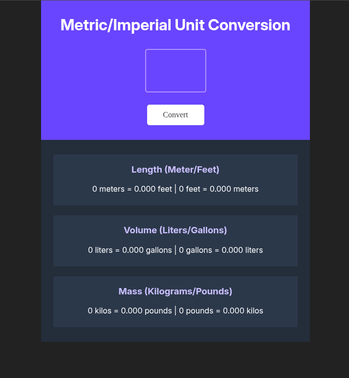

# ⚖️ Metric/Imperial Unit Converter

A responsive, single-page web app that converts user-input values across three core metric/imperial units: Length (Meters/Feet), Volume (Liters/Gallons), and Mass (Kilograms/Pounds). 

Built as a solo project for the **Scrimba Full Stack Developer Career Path**.

---

## 🚀 Live Demo

- **Live URL:** [View on GitHub Pages](https://puru33.github.io/unit-converter/)

---

## 📸 Preview

